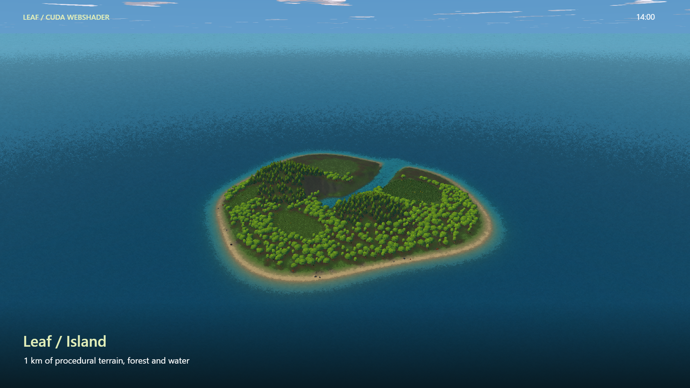

# Leaf: world editor guide

[Open the editor](https://samg-coder.github.io/Leaf/editor.html) · [Source project](https://github.com/SamG-Coder/Leaf)

Leaf builds stylized landscapes from seeded procedural assets. Trees, plants, terrain, water and the painted finish are rendered by CUDA WebShader kernels written in `.cu`, compiled for browser WebGPU. JavaScript provides the editor interface, input, persistence and GPU dispatch. You do not need a native CUDA installation to use the published browser demo.

Use a browser and GPU with WebGPU support. Open the HTTPS demo, or run `npm install` then `npm start` from this repository and visit `http://127.0.0.1:5197/editor.html`.

## Start with an example or an empty map

**New Project → Templates → Island** loads the supplied 1,000 × 1,000 metre island. It includes hills, coastline, an ocean, a lagoon, a flowing river, forest, undergrowth and four grass areas. The old forest stress-test entry has been removed.

To build your own world:

1. Click **New Project** and select **Blank landscape**.
2. Enter a map name and its width/length in metres. Maps are square.
3. Click **Create Project**.
4. Shape the ground in **Terrain**, then add vegetation and polygon areas in **Scene**.
5. Save a JSON file before leaving or replacing work you want to keep.

Map dimensions are chosen at creation and remain fixed during editing. Supported extent is 8–65,536 metres. Large extent does not imply unlimited dense geometry: rendering and edited terrain have bounded budgets.

## Understand the layout

The header contains the map name, New, Example, Load map and Save map. The toolbar switches Scene/Terrain, chooses tools, sets radius and offers Undo, Redo, framing and the grid.

The left library contains procedural asset collections and the Water plane and Grass area cards. Search by name or choose a category. The centre is the perspective viewport. The right inspector shows the selected object's controls, terrain/environment settings, style controls and camera settings. Scroll the inspector to reach lower controls. The bottom status bar reports rendering work and cursor coordinates.

[Watch the live island showcase](https://samg-coder.github.io/Leaf/showcase.html) for daylight, sunset, night, sunrise and weather views.

## Move the camera

| Input | Behaviour |
| --- | --- |
| Hold right mouse and move | Look around |
| Right mouse + W/A/S/D | Fly forward/left/back/right |
| Right mouse + Q/E | Fly down/up |
| Shift while flying | Move four times faster |
| Wheel while right mouse is held | Adjust flight speed |
| Middle mouse drag | Pan |
| Alt + left mouse drag | Orbit the current pivot |
| Alt + right mouse drag | Dolly |
| Wheel | Dolly toward or away from the pivot |
| F / Frame selected | Frame the selection |
| Home / Fit map | Frame the entire world |
| Q or H / Pan | Use left drag for navigation |
| Space + left drag | Temporarily pan |

Start with Fit map if you lose your bearings. For vegetation editing, stay outside the canopy and frame the selected object. Flying inside leaves obscures the scene. Set Fly speed explicitly for a small garden or a kilometre-scale world.

## Sculpt terrain

Switch to Terrain and select Raise, Lower, Smooth or Flatten. Radius controls the affected circle; strength controls the brush. Flatten also uses the chosen height. Drag on the ground to paint. One stroke becomes one Undo step.

A practical order is broad hills, lower basins/channels, smoothing, then flatter paths or clearings. Terrain supports heightfields, not overhangs or caves. Large maps use sparse local detail rather than a dense world-sized mesh.

Objects attach to terrain height after sculpting or moving. They remain upright; slope does not bend an object or tilt it to match the surface. Grass areas tile along the ground. Water stays at its separately chosen horizontal level.

Save terrain and Load terrain transfer only the terrain. Imported terrain must match the current map's dimensions. Existing objects remain and resample the new height. Reset terrain returns it to flat; use Undo to recover an accidental reset.

## Place procedural objects

Drag a library card over the ground to preview it, then drop to place it. Alternatively select an asset, choose Place, and click the ground. The collections are trees, bushes, flowers, ferns, moss, vines and ivy, grasses, crops, mushrooms, rocks/crystals, ground litter and deadwood/stumps. There are 121 procedural presets, plus polygon area cards.

Each placement has a preset, seed, position, rotation, scale and visibility. A seed reproduces the same procedural shape; changing the seed creates a variant. New placements use category-specific default scales.

Select an object in the viewport or hierarchy. Use Move, Rotate or Scale handles, or the numeric inspector:

- X/Z move across the ground.
- Rotation turns around the vertical axis.
- Scale changes size uniformly.
- Seed changes the procedural variant.
- Visible hides/shows the placement without deleting it.

Objects follow terrain height. Water alone exposes a vertical offset; regular vegetation does not float independently of the ground.

Shift-click adds/removes selection. Radius select groups anchors inside a world-space circle. Duplicate and Delete operate on the selection. Search the hierarchy by name or object ID to find placements in larger scenes. Only the first 200 search matches are listed. Frame selected brings a distant selection into view.

Use Undo/Redo in the toolbar, or Ctrl/Cmd+Z and Ctrl/Cmd+Shift+Z. Undo history is bounded, so portable saves remain important for major milestones.

## Grass areas and polygon editing

Place a Grass area from the library. It is a scene object with an editable outline. Select it to reveal corner handles and edge insertion controls.

Drag a corner to reshape the area. Click an edge's **+** to add a node. Select a node then choose Delete selected node to remove it; at least three nodes must remain. Smooth curved edges rounds the polygon boundary. The Corners text field allows precise X/Z coordinates, one per line. Keep a valid outline without crossing edges.

Choose grass species, spacing and scale in the inspector. Smaller spacing creates denser grass and more work. Seeded random grass rotation varies each tile consistently from the rotation seed. Changing the seed changes that pattern without making it flicker between frames.

Grass tiles follow terrain. The area is not a floating flat mesh. Up to 16 polygon plans and 32 control corners per plan are supported; grass generation is bounded to 8,192 tiles across plans. Very large, densely spaced areas can hit this limit.

## Water, lakes and rivers

Place a Water plane from the scene library. Edit its polygon with the same corner, edge, deletion and smooth-curve controls as grass. Water Y offset is an absolute level relative to world zero. Lower terrain beneath the surface to make a basin, then set the water level to the desired bank height.

Choose Pond, Lake or Coastal to change the ground/shore treatment. Transparency depends on depth: shallow water reveals the bed while deeper water becomes more opaque. Water is animated by default.

For a river, enable Directional river flow. Direction 0° points along +X and 90° along +Z. Set flow speed in metres per second. This advects the visual water pattern across a horizontal plane; it is not fluid simulation or a sloped river surface. Carve the channel to suit the chosen plane level.

The horizon ocean belongs in Terrain under Ocean & beach. Enable Ocean to the horizon and set Sea level. Low ground floods and coastal material transitions to sand and seabed. Use polygon water for bounded inland features.

The ground material responds to nearby placements and water: canopy shade, litter, soil, moss, rock, wet banks, sand and underwater beds. This changes appearance; it does not remove manually placed grass or trees. Keep dense vegetation back from beaches and river channels yourself.

## Time, clouds and weather

Terrain contains Sky, time & weather. Enable the system to drive sky and lighting from time of day. Drag Time of day for immediate preview. Play time advances the clock; Minutes per full day sets its pace. Pause freezes the clock while weather animation can continue.

Choose weather manually from Clear, Cloudy, Rain and Storm, or select Dynamic, based on time. Dynamic weather follows a deterministic seeded cycle. Day/night adds changing sun, moon and stars; clouds receive the stylized paint treatment.

Rain wets terrain and creates water ripples. Wetness dries gradually after rain. Vegetation bends with wind. These are rendering effects: there is no erosion or full hydrological simulation, and droplets/ripples are not tracked as individual physically simulated particles.

When environment control is enabled, it controls sunlight and shared weather intensity. Some manual sunlight, wind-speed and rain controls are therefore disabled. Water wind direction remains separately adjustable. Disabling environment control returns manual lighting/weather controls.

## Painterly appearance

Anime finish enables the shared stylized finish. The Anime style dropdown selects Painted Background, Cel Animation, or Ink & Watercolour. Painted Background retains the original appearance; Cel Animation uses clear light bands and stronger outlines; Ink & Watercolour uses pale washes and broken ink. See [style research and implementation](anime-styles.md). Cel Animation disables softness and paint controls because it bypasses those effects. Painterly softness blends compatible colour detail while preserving object/depth/light boundaries. Paint texture adds irregular pigment dabs; Ink outline strength controls outlines. Turn a control down to compare its contribution.

Trees combine persistent canopy surfaces with detailed procedural foliage so lighting and volume remain visible at different distances. Screen-space detail budgeting, culling and cached geometry reduce work. This is an approximation of painted foliage; tiny leaf silhouettes and close surface detail depend on distance and available budgets.

Style controls and camera are viewport/session settings, rather than portable world data. Save map preserves the world, including terrain, placements, polygons, water and environment settings.

## Save, load and recover

Save map downloads a validated `leaf-map` JSON file. Load map imports that file. Use descriptive filenames for milestones. Local autosave uses browser IndexedDB; it is convenient recovery on that browser, not a substitute for a downloaded backup. Browser data clearing or another device will not bring that autosave with you.

Invalid imports leave the existing map intact. New maps and successful loads are undoable while the relevant history is retained. Imported files are limited to 200 MB. The application supports up to 100,000 stored placements, but a view renders a bounded subset rather than every placement simultaneously.

## A suggested first scene

Create a 128 m world. Raise one low hill and lower a basin beside it. Smooth their transition. Add two or three trees with different seeds; use bushes and ferns around the roots and a few rocks near the pond. Put a curved Grass area in a sunny clearing. Place water over the basin and tune its height. Try rain, wait for the ground to wet, then return to clear weather. Save the map, create a blank map, and load the saved file to confirm the round trip.

After learning those tools, load the 1 km example and inspect its grass and water plans. It demonstrates the same controls at a larger scale.

## Performance and troubleshooting

If a view becomes slow, check dense grass spacing, the number of nearby unique seed variants and the amount of foliage covering the screen. First visits can generate new cached variants. Storm/rain and full-screen vegetation add rendering work. Hardware and browser affect results; recorded development timings are not guaranteed frame rates.

If controls seem missing, select the relevant scene object and scroll the inspector. If a polygon vanishes, check its visibility, outline and water height relative to terrain. If the viewport is obscured, use Fit map or Frame selected before flying again. If the renderer cannot start, verify WebGPU support and use HTTPS or localhost.

For implementation details and historical measurements, see [editor notes](editor.md), [weather](weather.md), and the source files under `src/`.
